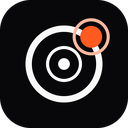
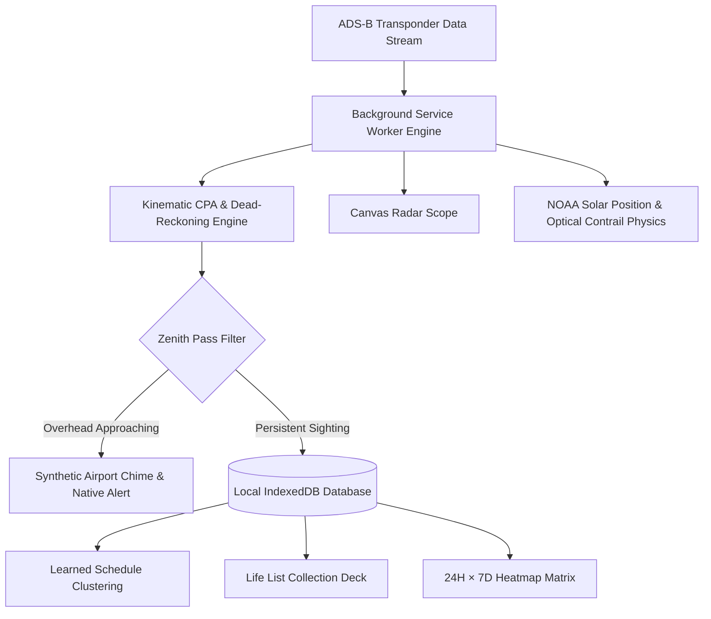

<div align="center">



# AIRVEE

### Overhead Flight Tracking Radar for Chrome
*Zero-Backend · 100% Local · Kinematic CPA Math · Canvas Scope · Manifest V3*

[](https://github.com/siddongare/airvee/actions)
[](LICENSE)
[](manifest.json)
[](tests/)
[](ARCHITECTURE.md)

</div>

---

## ⚡ Why Airvee?

Most flight tracking applications require expensive subscription APIs, run heavy proprietary cloud backends, track your GPS coordinates across third-party analytics SDKs, and notify you only *after* an airplane has already flown past your window.

**Airvee is fundamentally different:**
- **Zero Remote Servers**: Runs 100% in your local browser sandbox. No user accounts, no telemetry, no tracking pixels.
- **Predictive Trajectory Math**: Uses spherical Haversine geometry and quadratic closest-point-of-approach (CPA) vector calculus to predict overhead passes **90–150 seconds before zenith**.
- **Accurate Direction & Look Angles**: Tells you exactly where to look (*e.g., "Look SW, 42° up (front-left)"*), calibrated to your home or office balcony facing direction.
- **Cockpit Minimal Aesthetic**: Pitch-black (`#09090B`), hairline dividers, tabular numerals, and Signal Orange accents inspired by modern aircraft primary flight displays (PFDs).

## Why I built this

I live in Central India, which sits under busy long-haul routes. A lot of Ethiopian, Qatar Airways and Emirates flights pass overhead, and I kept missing them. Flight-tracking apps show where a plane is, but I wanted something that taps me on the shoulder two minutes before it arrives and tells me which way to look. Airvee is that: a small extension that predicts the closest point of approach to my exact spot and turns it into a direction and an angle.

I built it with AI coding tools and then tested, reviewed and reshaped it myself. The geometry is documented in [docs/geometry.md](docs/geometry.md) so you can check the maths rather than take my word for it.

---

## 🛰️ Architecture & System Pipeline



---

<!-- TODO: Add real screenshots (docs/images/live.png, radar.png, log.png, stats.png) and demo.gif once captured -->

## 🌟 Key Features

### 1. Canvas Radar Scope
- **Smooth Sweep**: Continuous rotating beam with Signal Orange persistence decay.
- **Relative "Facing Up" Mode**: Aligns the radar with your physical facing orientation (*e.g., South at 12 o'clock*). Looking straight out your window corresponds 1:1 with the top of the scope.
- **Target Inspector**: Tap any radar blip to lock target, draw heading trajectory vectors, and inspect altitude, ground speed, distance, and ETA.

### 2. Kinematic Closest Point of Approach (CPA) Engine
- Dead-reckons positions between poll cycles using velocity vectors and track headings.
- Calculates exact horizontal distance at CPA, bearing at CPA, and curvature-corrected elevation angle.

### 3. Watchlist & Rare Aircraft Alert Engine
- Customizable rule matcher: Aircraft type (*e.g., A388, B748, C17*), Airline (*ICAO/name*), Registration (*e.g., A6-EEA*), or Callsign prefix (*e.g., ETH, EK*).
- **"Rare for me" Algorithm**: Alerts when an aircraft has been seen fewer than $N$ times in your personal history, or matches bundled rare/military airframes (`rare_aircraft.json`).
- Distinct 3-tone ascending chime synthesized via Web Audio API.

### 4. Collection (Life List)
- Automatically compiles unique Airlines, Aircraft Types, and Registrations with first-seen, last-seen, and total sightings count.
- Badges never-before-logged airframes with a **`NEW`** indicator.
- Scope toggling between *Overhead Only* vs *All In-Scope*.

### 5. Learned Schedule & 24H × 7D Heatmap
- **"Likely Today" Clustering**: Discovers recurring flights passing within $\pm 20\text{ minutes}$ on at least 3 of the last 7 days.
- **Heartbeat Gap Detection**: Tracks browser inactive/sleep periods to guarantee honest predictions without guessing.
- **Interactive Heatmap**: 168-cell matrix mapping traffic density across every hour of the week.

### 6. Optical Visibility & Sun Physics
- Real-time NOAA solar astronomical positioning algorithm.
- Classifies ambient sky conditions (*Day, Golden Hour, Civil Twilight, Night*) with Open-Meteo 30-min cached cloud cover to generate optical hints (*"Belly illuminated", "Look for anti-collision strobes", "White contrail high contrast"*).

### 7. Real Aircraft Photography (Opt-In)
- Integration with Planespotters.net public photo index with 14-day persistent caching.
- Strict compliance with photographer attribution requirements.

---

## 🛠️ Installation & Setup

1. **Clone the repository**:
   ```bash
   git clone https://github.com/siddongare/airvee.git
   cd airvee
   ```

2. **Load Unpacked into Chrome**:
   - Open Chrome and navigate to `chrome://extensions/`
   - Enable **Developer mode** (toggle in upper right)
   - Click **Load unpacked**
   - Select the `airvee` project directory

3. **Configure Observer Station**:
   - Click the Airvee extension icon in the toolbar
   - Switch to **Settings**
   - Enter your Latitude, Longitude, and the direction you face (*e.g., South*)
   - Set your desired detection radius and overhead alert threshold

---

## 🧪 Testing & Verification

Airvee maintains a zero-dependency, comprehensive unit test suite running on Node's native test runner (58 passing tests across 13 modules):

```bash
# Run complete test suite (58 tests across 13 modules)
npm test

# Run syntax & module import check
npm run check

# Run full CI pipeline
npm run ci
```

### Test Suite Breakdown
| Module | Focus |
| :--- | :--- |
| `geo.test.js` | Haversine distance, bearings, elevation with Earth curvature, ENU tangent plane, CPA math, dead reckoning |
| `coordinates.test.js` | Full double-precision persistence, comma/semicolon parsing, display formatting |
| `radar.test.js` | Polar-to-cartesian projection, Facing-Up rotation, hit-testing |
| `settings.test.js` | Schema migrations (v1–v5), preservation of custom coordinates |
| `airline-logos.test.js` | IATA/ICAO resolution, dashed cargo badges, orange watchlist accents |
| `watchlist.test.js` | Rule matching, cargo vs military filtering, "Rare for me" counting, WAV synth |
| `audio.test.js` | Procedural Web Audio chime synthesis and WAV header generation |
| `schedule.test.js` | Window clustering, heartbeat gap detection, 7×24 heatmap matrix |
| `visibility.test.js` | NOAA solar elevation, solar zenith angles, Open-Meteo cache |
| `photos.test.js` | Registration sanitization, 14-day cache, 24-hour negative cache |
| `lifelist.test.js` | Sighting aggregation, unique airframes, "NEW" badge detection |
| `mock.test.js` | Simulated overhead trajectories and provider isolation |
| `db.test.js` | IndexedDB flight logging, deduplication, and persistence |

---

## 📚 Technical Documentation

For an in-depth mathematical walkthrough of the kinematic CPA algorithm, NOAA solar formulas, ENU projections, and Web Audio synthesis, read [**ARCHITECTURE.md**](ARCHITECTURE.md).

For data sovereignty, permissions, and zero-telemetry commitments, read [**PRIVACY.md**](PRIVACY.md).

---

## 📄 License

Airvee is released under the [MIT License](LICENSE).
